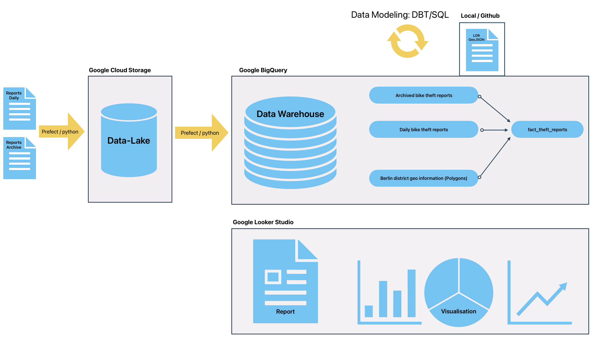
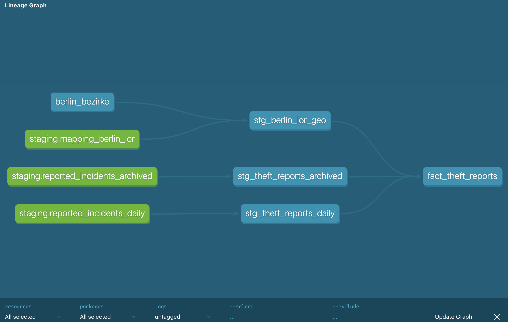
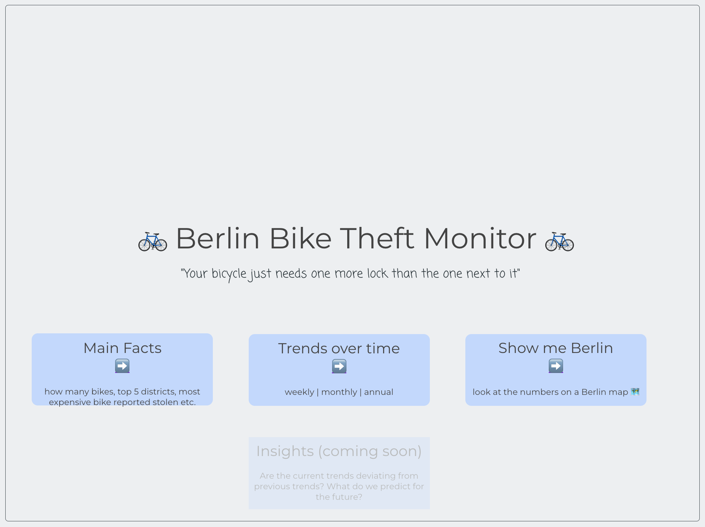
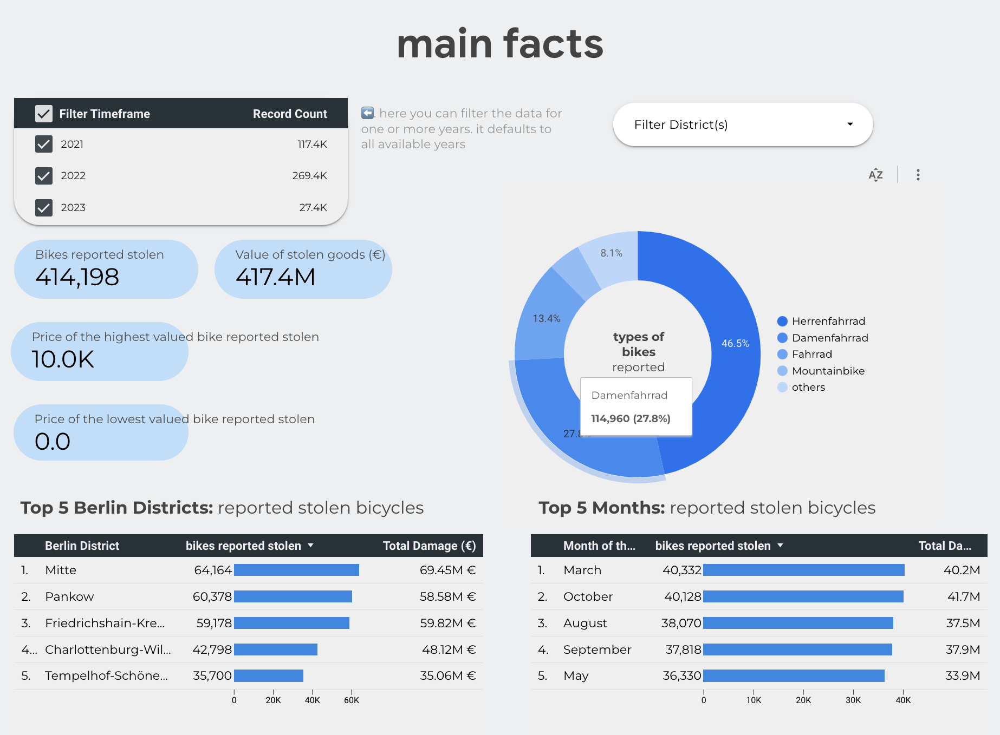
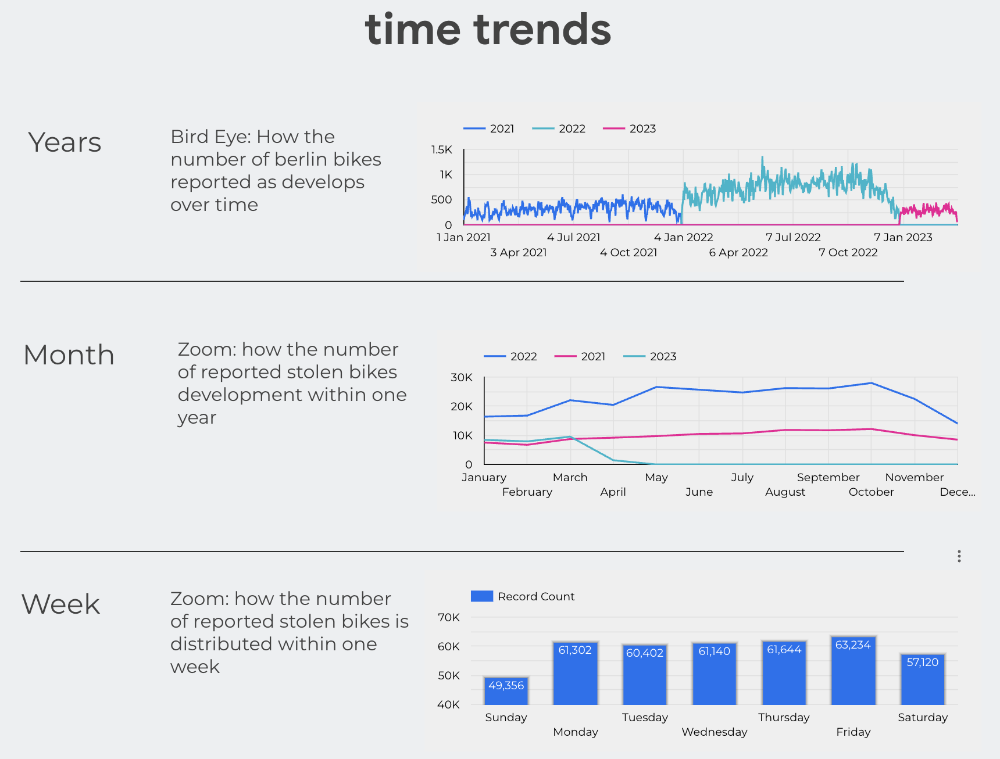
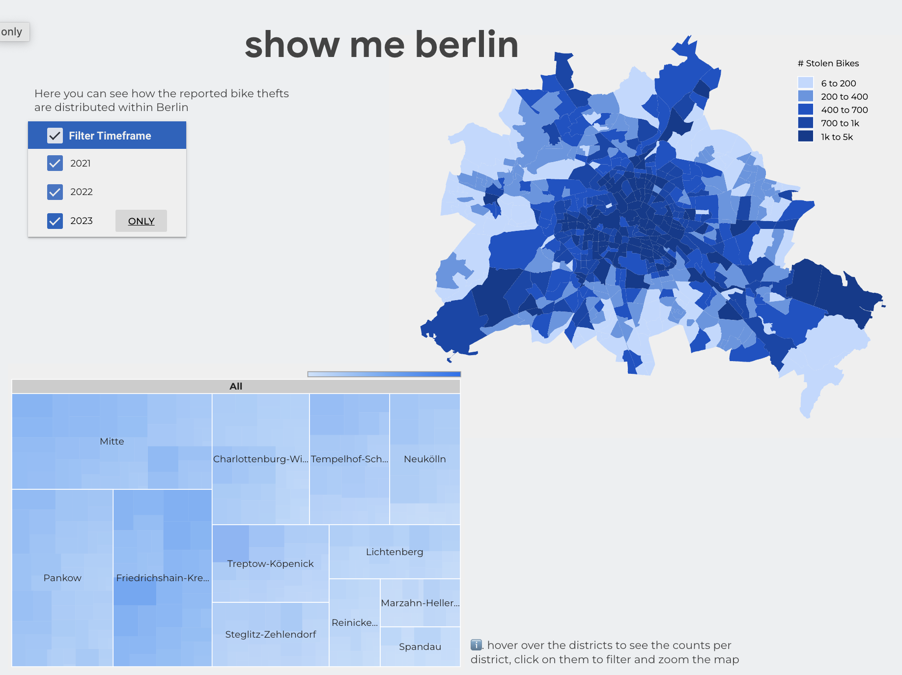

# Daily data on Berlin bike thefts

> "Your bicylce just needs one more lock than the one next to it


There used to be a time when the average lifetime of my bicycles in Berlin was about one year - until they were stolen. This changed when my local bicycle dealer suggested to get a second lock from another brand. Coincidence?

That's where this project comes in - to learn more about the key numbers and trends of bike theft in Berlin, I am developing a fully automated batch process that ingests [daily berlin bicycle theft data](https://daten.berlin.de/datensaetze/fahrraddiebstahl-berlin) reported by the police in Berlin, and stores it in a data lake (Google Cloud Storage) together with archived data that is not published anymore. The data flow between the data lake and the data warehouse (BigQuery) is orchestrated with prefect and transformations in the DWH are transforms it with the power of python and dbt. But why stop there? Using Google Data Looker, the data is visualized, providing insights into the patterns and trends of bicycle theft in the city. Ready to take a ride with me and see how this all comes together? Let's go!


## Insights

- **Time trends**: Analyzing the temporal trends in bicycle theft can reveal patterns in the types of bikes stolen, the times of day when thefts are most likely to occur, and the days of the week when thefts are most common. This can help the community to take preventive measures during high-risk periods.

- **Hotspots**: By analyzing the location data of reported bicycle thefts, we can identify the areas in the city where bike theft is most common. This can help the authorities to allocate resources more effectively to prevent theft and catch thieves.

- **Bike characteristics**: Examining the characteristics of the bikes that are stolen, such as their make, model, and price, can provide insights into the types of bikes that are most targeted by thieves. This information can be used to raise awareness among bike owners and to help bike shops take measures to protect their inventory.


## Architecture




### Data Source
Every day, the berlin police uploads a csv file containing the most recent data on berlin bike thefts on one of the [Berlin Open Data Portals](https://daten.berlin.de/datensaetze/fahrraddiebstahl-berlin). The dataset includes information about the value of the bikes reported as stoled, the suspected timeframe in which the bike got stolen and the approximate location of the incident. 
  - *when you clone the repo and run `poetry run dbt docs serve` you can browse through the data documentation*

### Data Storage
The data is first stored in a data lake (Google Cloud Storage) and then procecced and loaded into a DWH (BigQuery). If the dataset was a lot bigger than it is now, it would make sense to partition the data by date, and or by berlin disctice, since these variables will probably be used often for grouping and querying the data. With the dimensions of this project, these optimizations are not necessary yet.

### Transformations
The data in the DWH is transformed with dbt in the following way: the data from the archive (hich is not contained in the daily dumps from the police) and the daily updates are unioned and the data is anriched with geo-based information (polygon coordinates) to be able to map the numbers onto a map later on.



### Visualization
the data is visualized in a Google Data Looker ["Berlin Bike Theft Report"](https://lookerstudio.google.com/reporting/8a06d083-e46f-403a-bcb0-d3ff23434e24), where the data is connected to the facts table created in the DWH. The data is visualized in a mix of tables, info-boxes, line graphs and a chloreopleth map of Berlin, where the number of bike thefts is visualized by district. The map and other parts of the dashboard are interactive, so that the user can filter the data by date and district. Generally the reports is ordered into three main topics:
  
  -  looking at the **main facts**
  -  looking at **trends over time**
  -  looking at **distribution on a map of berlin**







### Reproducibility

#### Prerequisites

- [ ] Install [poetry](https://python-poetry.org/docs/#installation)
  - [ ] install dependencies by running `poetry install`
- [ ] Create Google Cloud Storage Bucket
- [ ] Create Google BigQuery Dataset
- [ ] Manage credentials with prefect [blocks](https://docs.prefect.io/latest/concepts/blocks/) and [secrets](https://discourse.prefect.io/t/how-to-securely-store-secrets-in-prefect-2-0/1209)
- [ ] Setup dbt 
  - [setup the profile]( https://docs.getdbt.com/docs/quickstarts/dbt-core/quickstart) in `~/.dbt/profiles.yml`

  ```bash
  # example 
  berlin_bike_theft:
    outputs:
      dev:
        dataset: berlin_bike_theft
        job_execution_timeout_seconds: 300
        job_retries: 1
        # path to the service account keyfile
        keyfile: /Users/example_user/.gcp/de-engineering-private-key
        location: EU
        method: service-account
        priority: interactive
        project: example-bq-dataset-id
        threads: 4
        type: bigquery
    target: dev
  ```

  check if it works with
  ```bash
  poetry run dbt debug
  ```
### Daily Updates
- [ ] Build the prefect ETL deployment with

  ```bash
  poetry run prefect deployment build flows/extract_web-to-gcs.py:etl_web_to_gcs -n "Berlin Bike Theft ETL" --cron "0 12 * * *" -a
  # start agent to execute the flow
  poetry run prefect agent start --pool default-agent-pool --work-queue default      
  ```

  start the prefect UI with 
  ```bash
  poetry run prefect server start
  ```
  - or alternatively run the python files
  ```bash
  # setup
  poetry run python flows/setup.py
  ```
  - to get the daily data run 
  ```bash
  poetry run python flows/extract_web-to-gcs.py
  poetry run python flows/load_gcs-to-bq.py
  ```
  - to model the data from BigQuery run
  ```bash
  # cd to the dbt folder
  cd berlin_bike_theft
  poetry run dbt run
  ```

  look at the data documentation with
  ```bash
  poetry run dbt docs serve
  ```